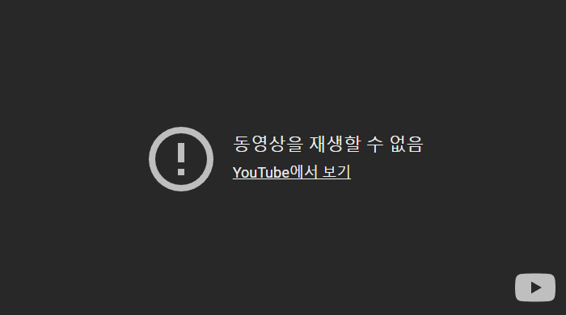

# hasuki

Free frontend-only YouTube player

* 돈 안쓰고, 광고 없이 보기
* 돈 안쓰고, 일시정지 없이 보기
* 돈 안쓰고, 스마트폰 백그라운드에서 듣기


## feature

* 플레이리스트 재생
	* https://hasuki.vercel.app/?list=PLqeVDqAa1AFbY2JCCVapGggt_pbeMIlDX
	* query string: `list=[playlist]`
* 비디오 재생
	* https://hasuki.vercel.app/?v=P1cyCAUTWVg
	* query string: `v=[video_id]`
* 믹스 재생
	* query string: `list=[playlist]&v=[video_id]`
	* 유튜브 믹스는 video_id가 리스트의 시작점으로 사용된다.
* URL 기준으로 적당히 처리
	* https://hasuki.vercel.app/
	* youtube url 넣고 play 선택
	* 일반 비디오, 플레이리스트, 믹스 지원

## known issue

### 재생 안되는 에러

case 1.
```
Error: HTMLAudioElement, type=Event_HTMLAudioElement
https://rr5---sn-p5qlsnd6.googlevideo.com/videoplayback?.....
```

case 2.


해결책: 오른쪽 아래의 plain/music 눌려서 상태 변경

원인: hasuki는 2가지 방식(ytdl-core, react-player)으로 유튜브를 재생한다.

* plain: react-player로 재생 중
* music: ytdl-core로 재생 중

[ytdl-core][github-ytdl-core]로 얻은 URL로 가끔 재생되지 않는 문제가 있다. 이를 고치는건 hasuki의 범위에서 넘어가서 던졌다.

[react-player][github-react-player]는 가끔 "동영상을 재생할 수 없음"이 뜨는 문제가 있다. 유튜브 프리미엄 쓰라고 유튜브에서 띄우는거같은데...

재생 방법을 바꾸면 어떻게든 재생된다.
ytdl-core, react-player가 동시에 고장나는 일은 적다.

[github-ytdl-core]: https://github.com/fent/node-ytdl-core
[github-react-player]: https://github.com/cookpete/react-player
